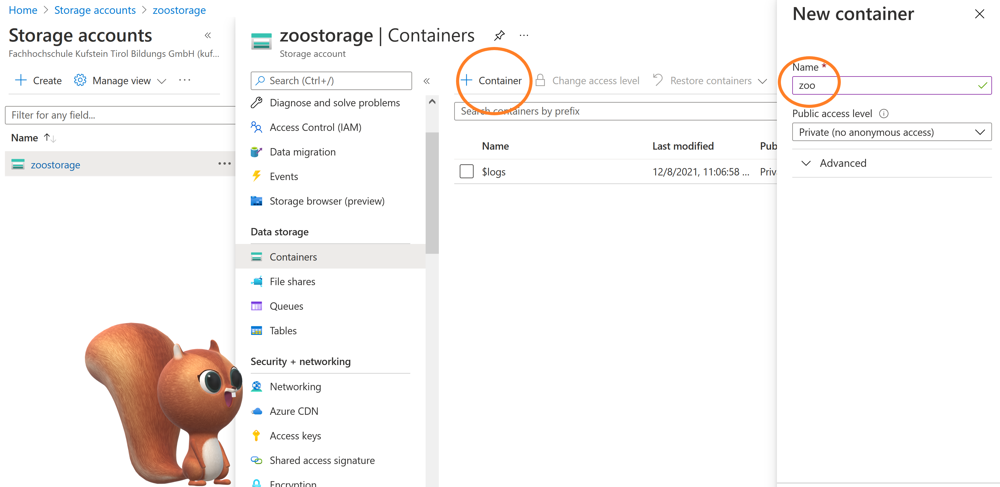

# FROM SPARK AND GOOGLE COLAB TO AZURE DATABRICKS: BIG DATA FOR BEGINNERS

The significant expansion of the amount of data, called big data, is enhancing problem solving. For many use cases, big data can provide a solution for forecasting situations in order to take data driven decisions. A practical example would be the flight delay detection. Many airports in the world were getting overwhelmed (before COVID 19). For example, in Vietnam the increasing number of passenger and flights delays was leading to high traffic jam in 2019 as you can see below:

Is a flight delay detection possible ? How is it possible to deal with a huge amount of data? Can Big Data be a solution for any use cases? We will firstly try to deal with the [big dataset of Kaggle](https://www.kaggle.com/bulter22/airline-data) using Google Colab and Spark.

Then we will analyse the results of this experiment. Finally we will see another cloud solution : the Azure portal, which enables to use Azure Databricks.

The blogpost is available [here](https://steadfast-flight-221.notion.site/Big-data-processing-98ff0de9f4424dad98fae676f65f0b11)

The Git Hub corrresponding is available [here](https://github.com/Alienor1268/flight.git)

I enjoyed writing this blogpost as a student of the master program Data Science & Intelligent Analytics at [FH Kufstein Tirol](https://fh-kufstein.ac.at/Studieren/Master/Data-Science-Intelligent-Analytics-BB).

# First trial with big data: google colab and spark for flight delays

Let's try to load and work with our Flight Delay dataset in Google Colab! We will see why it's interesting and usefull to use Google Colab. 

### What are the advantages of Google Colab?

Google Colab is thought for research project, the colaboration files are hosted in Jupyter Notebooks (but we can use R with the command %%R). Thanks to the free access, GPU and TPU can be easily used.  With Google Colab, data are stored in the cloud, it allows collaboration between several users. Google Colab allows users to run machine learning algorithms in a
 cloud environment. The preinstalled libraries are pandas, numpy, Matplotlib. Machine learning tools such as Keras, Tensorflow, Pytorch are pre installed, which make it easier for beginners!

Thanks to the regitration with the google drive account, Google Colab is effortless accessible. 

This collaboration Plateform is offering direct link to Kaggle and Git Hub.

### How is built Google Colab?

Google colab is a specialized version of a Jupyter notebook, it's based on Ipython, which is an interactive terminal or shell for Python programation. Notebooks Environement like Jupyter Notebook are running with Ipython; It provides powerfull python shells and a web based notebook ( which allows to write code, text, images..)

What is the difference between Python and Ipython? 
Python is a general programing language ( created by Guido van Rossum in the 80s). Ipython which has been created in 2001 is providing a read-eval-print loop (REPL) environment.

Ipython is offering an interface to use python code and a kernel with frontend interfaces.

### Easy to set up

Google Colab doesn't need an environement, it's easy to set up for beginners. All the 
files are stored in google drive. It's easy to start , there are a lot of tutorials online and it's very user friendly.

How can we set up our work environment?

The Kaggle Dataset with 12GB can be directly imported from Kaggle, we don't need to load it local on our computer, we firstly need to set up the connection with Kaggle, by writting the command below:

If you want to write in R with Google Colab, it's possible by writting the command: 

### A cloud based solution

A cloud enables users to access files from any kind of device, files are not stored locally. 
Google Colab can work as a virtual machinne, it means that it works like a digital computer only.

Google Colab allows users to get extra computing power. But, you need to know, that Google Colab is not a storage solution, the files get deleted as soon as the session is closed. You will need to reload it afterwards. 

For performing big data in Google Colab: we can use Spark which is framework used for big data. If we are using a cloud solution such as Colab and a framework such as Spark, we can hope performing big data. With Google colab it's possible to train large machine and deep learning algorithms. Machine learning algorithms can need large computational power, Google Colab is providing classical CPU run time, but free TPU and GPU too,  in order to empower this expensive computational process.

A GPU is performing parallel computation, it enables speed maximising. You can choose in settings of Google Colab between: GPU, CPU or TPU.

### Performing Big Data with Spark
Spark is well known for its speed, even if the dataset is big, it's possible to get results quickly. For example, Spark can be 100 times faster than Mapreduce.  Many programing languages can be used with Spark, such as SQL, R, Python, Scala, and Java. Spark is open source and has many contributors around the world and is evolving constantly. Spark can offer as well Real Time Stream Processing.

Spark is a new technology, Sparklyr is newer than Spark, some features in Sparklyr are not available like in Spark with python or scala.

In R the Sparklyr library enables to use spark, you can run the code below in order to deal with Spark:

The Spark cluster needs to be started and then we copy the dataset into it. A [spark_read_csv()](https://www.rdocumentation.org/packages/sparklyr/topics/spark_read_csv) would be available to read directly the file in Spark.

![start_spark_load_dataset_into_spark.JPG]
To conclude, we can say that Setting up Google Colab and start a Spark Cluster was uncomplicated. But We notice that one limit of Google Colab is that we need to reload the dataset each time we want to use it. It's not very convenient, but nevertheless, Google Colab enables users to work remotely from anywhere and can be set up effortless.

# Analysis of the results - Small data vs. big data: do we need big data?

### Do we get different result while scaling the flight data?

The problem  is that the flight delay dataset is too big for Google Colab and makes it collapsing. 

I tried to scale up the dataset:  with 5 million rows modelling is not possible, the Google Colab is stopping ( not enough RAM ). 

 

We can try scaling from 10000 rows to a million rows. I trained a random forest model in order to do the comparison.

You can see the results below:

By reading 10000 rows, we get an rmse of 13.24

By reading 100000 rows, the RMSE is then 22.56. This result sounds weird: while scaling the dataset to 100000 rows, we should have get a better RMSE and not a bigger one.

While scaling with a million, the RMSE is then 15.96. The results were better with just 10 000 rows...

 In this example of Flight Delays, we can't say that it was really a big data problem, because, the dataset was originally 12GB and I managed to read just a part of it.

But this leads me to ask me questions regarding the difference between small and big data, when can we talk about Big data and if we still need small data. 

### The differences between small and big data

**small data**
Generally, small data are obtained in an organized manner. Small data usually refers to meaningfull insight which are adressing a specific problem or describing a current situation, small data are helping to take a quick decision regarding a current topic ( which is very usefull for a company).

Small data are good at accomplishing one task, they are answering targeted queries. Small data are refering to "limited volume, non-continuous collection, narrow variety and are usually generated to answer specific questions"

**Big data**
The main caracteristics of big data are:

- Variety which is related to the variety of data.
- Velocity which refers to the speed of moving data
- Volume (the amount of data)
- Veracity which is related to the quality and accuracy of the data.
- Value which refers to the value of each data

If the data have one or more of these caracteristics, it can be considered as big data.
Different kind of data can be processed with big data, it refers generally to structured, semi-structured and unstructured and Big Data is generally measured in terrabytes or exabytes.

### **Has small data still value in a world of big data?**

Could the big data replace small data? Big data is considered as "hyped", companies are collecting and investing a lot in big data. It makes the data exposed to the data market and to data brockers (which can be dangerous). This data processing could lead to "dataveillance, social sorting, control creep, and anticipatory governance".

Before 2008 there were no differences between small and big data. But since 2008, the big data paradigm has emerged and is refering to the fact that businesses and governments are using big data as main insight into their strategies. It assumes, that big data is able to solve any problem. 

According Vishal Chawla, senior tech journalist at Analytics India Magazine, "the saying that businesses need a lot of data is a myth".

The principle "garbage in, garbage out’’, it means that big data is capturing what is easy to ensnare. In fact big data comes from sensors and automatisations. This reasoning implies that big data doesn't really need quality. As new technologies are expanding, data from sensors are for example considerably increasing. 

According to this approach, [Mayer-Schonberger and Cukier (2013: 13)](https://www.researchgate.net/publication/282158923_Small_data_in_the_era_of_big_data) are explaining , that ‘‘with less error from sampling we can accept more measurement error’’ (p.13) and ‘‘tolerate inexacti-tude’’ (p. 16). It means that, big data wouldn't need to be based on high qualtitative data.

For training machine learning models, we need data of good quality, it can enhance the performance of our models. It's not only the amount of data but the quality which needs to be high, in order to perform well. 

### **Too much data: could it be a risk?**

Big data allows researcher to reach the natural noise of the data: thanks big data the performance of our models is improving, but there is a point after which their performance is not improving any more.

Big data can't help in case of an overfitting problem: an overfitted model has low bias and high variance. The model is then training too much, and we lose performance on prediction dataset.

According to Michael Berry, analytics director at Trip advisore "Many predictive analytics applications turn out not to need all of the data". It's relates to the fact that ,gaining more data won't change things at one point.

To conclude Big Data is nowadays earth-shattering and unmissable, but we need to pay attention to the quality of data we are using. There is as well one point (natural noise) where Big Data can't improve the performance of our model anymore.

# Another cloud solution with the Azure Portal: how can we create a Blob Container?

### Azure Blob Storage solution

As we see before, Google Colab is not offering a storage solution, which is not so convenient for developing in team. Even for working private, we need each time to reload the dataset...

In opposition the Azure Portal from Microsoft is offering a storage solution and could be a solution to store online data.

The Azure portal is offering many types of storage: Blob storage, files storage, table storage, queue storage and the disk one. A Blob storage is an easy solution for storing data for beginners, It’s accessible for free with a student account.

The Azure Blob Storage (Binary Large Object) is a cloud solution which is enabling a storage solution for unstructured data. A variety of data can be stored into a Blob storage  such as for example text, images, videos…

A Blob storage can be typically used for creating  data lake, training Machine learning algorithms and high performing computing. Different programming languages such as Java, Python, Ruby, PHP… are supported in a Blob storage. For uploading large files in a Blob, it ‘s possible to divide the file into chunks.

## A Blob storage is consisting on 3 different components:

- A storage account
- A container
- A Blob

Large amount of data can be stored in different containers, each user has an account. More user accounts can be involved in order to share files. The aim of this approach is to share informations with co workers for example.

An azure Blob Storage is reliable and consistent and enables collaboration, a good storage organization, and allows to  upload ord modify files on needed.

### A Blob storage can be divided into 3 categories:

- Block blobs for storing text and binary data
- Append Blobs which consist on Block Blobs for logging data from virtual machines
- Page Blob stores random access files ( > 8 TB)

### What are the advantages of a Blob Storage?

- An Azure Blob Storage can support different kind of data: unstructured, structured
- Data are retrievable from anywhere in the world ( Http and Https).
- Streaming data are supported
- The security level of a Blob storage is high: the blob storage can be redundant, it means, that it’s possible to have copies in different georgraphic areas. An azure Blob storage has then back up, redundancy, recovery an disaster recovery functions.
- A Blob storage is offering different memory level.
- A Blob storage is scalable.
- It allows massive data storage
- A Blob storage is easy to use
- Azure Portal is offering a monitoring system.

### How can we create a blob storage?

We can train for our tutorial with the Kaggle dataset, you can find it [here.](https://www.kaggle.com/rishidamarla/zoo-animal-life-expectancies)

1- Select “Storage accounts” on the azure Portal ( pay attention: there are many options for storage accounts)

Create a new Storage account:

3 - Setup the new storage account:

Firstly you need, to give the name of resource group, if you don’t have one, you can create a new one.

The new storage solution needs a name and you can select GRS ( for Geo Redundant Storage- it’s for a security reason and limiting the risk of failure).

Advanced : you can here choose if you want a Blob Storage accessible to public or not and set up a key access.

Networking : we can choose if the Blob container is accessible only from our private network.

Set up the data protection: It ‘s possible to track versioning and changing of our blob account.

CONTAINER : create the last part of our blob storage, create a container, define a name and upload the file we need.

To conclude, the Blob storage is easy to set up and to use, let's see further what we can with a Blob storage!

# Azure Portal: Why should we start with Databricks? How can we do it? 

As we see before with the flight delay dataset on Google Colab, we could't read the full dataset...which is a pity.

Azure Databricks is a service in Azure which is based on Apache Spark and Databricks, resulting of the collaboration between Microsoft, Apache and Databricks. It's combining the performance of a public cloud and the efficiency of a big data platform. Apache Spark is well known for its speed and therefore Azure Databricks enables Business Productivity enhancement, thanks high scaling capacity. Azure Databricks offers many solutions from machine learning modelling with Spark to connections to visualization tools like Power BI. ´

### Collaboration

The Azure Workspace is enhancing the collaboration between coworkers within the company  for machine learning. Thanks the version control which is built-in, the collaboration get smoother. Azure Databricks enables the cooperations between different kind of stakeholders in the company ( engineers, data scientists, business analysts…)

### An integrated solution

Databricks is the latest big data tool from Microsoft, it gets easily integrated with all the Microsoft tools. The Databricks workspace can be linked effortless to the Blob storage or to a data lake, as we will see in the example below. It makes it easier for the users to work with the tools.

### Develop effortless

Azure Databricks enables to use commonly  programming languages such as Python, R, Java or SQL. The workspace allows to switch programming languages. In the example below we will show that a connection to Blob container is easy to be done in Python, but then SQL queries enable an easy management of the dataset. This makes it easy for new developers to start programming. We can notice that Azure Databricks is offering:

- DataFrames with Spark SQL
- GraphX
- Machine Learning (ML)
- Streaming support

A juypter noterbook is as well convenient to start working with Azure Databricks, because it enables to check each programming steps. Tutorials and documentation are available in order to start correctly working with databricks.

No maintenance is required with Azure Databricks, it’s possible to scale up and down quickly and effortless. An Azure Databricks cluster is easy to set up for beginners, and the high scalability enables the user to save money. The infrastructure is totally uncomplicated, which allows the user to focus more on content.

### A high security

Databricks is using the Azure Active Directory (AAD) security framework which encounters strong authentication management system. AAD is as well controlling access in order to fight against violated identity. Thanks these secure framework, users can work on Azure Databricks confidently

Prices “Pay as you Go” look like:

### How can I start with Azure Databricks?

1- Firstly you need to create an azure workspace:

Here we can see what create until now: the Blob storage and the Azure Databricks workspace in the category resources.

2-	We then need to create a new cluster:

We here need to define a name, the Databricks runtime version. We can choose to stop the enable autoscaling and to set up one worker and to take the smallest server standard_F4. The dataset we will use is small, and we don’t need so much power. With just one worker, it will compute faster.

We see here that the cluster is correctly running! 2 nodes are used.

In order to start programming we then need to create a notebook, you can see below, how we can create it:

We setup a name and choose the programming language ( we can choose ptython, R or scala)

The notebook is here! We decide now to link the Blob container into the Azure Databricks cluster, we can run the following code ( which is mainly provided by Azure itself [here:](https://www.youtube.com/watch?v=M7t1T1Q5MNc&t=1045s) 

The Azure storage system is providing a SAS token, we can get it directly from the Blob configuration. The Blob relative path is referring to the path in the blob storage.

We can then start using our dataset with SQL queries!

To conclude Azure Databrick can be set up effortless and will allow to train machine learning algorithms on a virtual machine. In comparison, Google Colab and Spark were offering a good possibility to start and to train with Big Data concepts. We saw as well, that the quality of the data is important to get good results while performing modelling.

# SOURCES

[https://towardsdatascience.com/4-reasons-why-you-should-use-google-colab-for-your-next-project-b0c4aaad39ed](https://towardsdatascience.com/4-reasons-why-you-should-use-google-colab-for-your-next-project-b0c4aaad39ed)

[https://plotly.com/python/ipython-vs-python/](https://plotly.com/python/ipython-vs-python/)[https://medium.com/@rmache/big-data-with-spark-in-google-colab-7c046e24b3](https://medium.com/@rmache/big-data-with-spark-in-google-colab-7c046e24b3)[https://www.analyticsvidhya.com/blog/2020/03/google-colab-machine-learning-deep-learning/](https://www.analyticsvidhya.com/blog/2020/03/google-colab-machine-learning-deep-learning/)

[https://vietnamnews.vn/society/524149/viet-nams-airports-overwhelmed-as-passenger-numbers-keep-rising.html](https://vietnamnews.vn/society/524149/viet-nams-airports-overwhelmed-as-passenger-numbers-keep-rising.html)

[https://www.ibm.com/cloud/blog/hadoop-vs-spark](https://www.ibm.com/cloud/blog/hadoop-vs-spark)
[https://www.researchgate.net/publication/282158923_Small_data_in_the_era_of_big_data/link/5797323c08ae33e89faec2ad/download](https://www.researchgate.net/publication/282158923_Small_data_in_the_era_of_big_data/link/5797323c08ae33e89faec2ad/download)

[https://towardsdatascience.com/what-is-big-data-lets-answer-this-question-933b94709caf](https://towardsdatascience.com/what-is-big-data-lets-answer-this-question-933b94709caf)

[https://hbr.org/2013/12/you-may-not-need-big-data-after-all](https://hbr.org/2013/12/you-may-not-need-big-data-after-all)

[https://analyticsindiamag.com/is-more-data-always-better-for-building-analytics-models/](https://analyticsindiamag.com/is-more-data-always-better-for-building-analytics-models/)

[https://www.researchgate.net/publication/261947134_Big_Data_Paradigm-_Analysis_Application_and_Challenges](https://www.researchgate.net/publication/261947134_Big_Data_Paradigm-_Analysis_Application_and_Challenges)

[https://searchcio.techtarget.com/opinion/Big-data-and-predictive-analytics-When-is-enough-data-enough](https://searchcio.techtarget.com/opinion/Big-data-and-predictive-analytics-When-is-enough-data-enough)

https://www.storage-insider.de/was-ist-microsoft-azure-blob-storage-a-992080/

https://www.youtube.com/watch?v=Zm7vPBlq8Wg&t=18s

[https://www.youtube.com/watch?v=M7t1T1Q5MNc&t=1045s](https://www.youtube.com/watch?v=M7t1T1Q5MNc&t=1045s)

[https://global.hitachi-solutions.com/blog/6-reasons-to-use-azure-databricks-today](https://global.hitachi-solutions.com/blog/6-reasons-to-use-azure-databricks-today)

