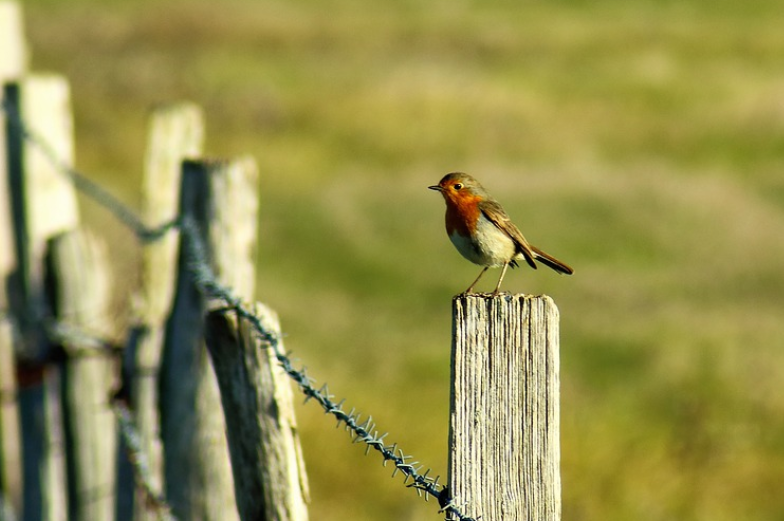

# PORTFOLIO

Why make a portfolio? 
A portfolio allows you to showcase your work and the skills you have acquired during your various projects. It allows you to show the application of different techniques and skills. 

This portfolio includes my various researches and studies on many themes, mainly related to nature. The part programmed in R is the most important, it is the programming language I practice the most, so that's why the works are more advanced.
This portfolio gathers what is possible for a beginner in computer programming. The portfolio shows what skills I have acquired over time. As I started my studies 2 years ago, I am very proud to show what has been accomplished so far

Picture from: https://pixabay.com/photos/red-throat-nature-bird-winter-3952917/

I focus particularly on the visualizations that are possible with the different techniques used. I think it's always amazing the results you can get and the freedom and range of possibilities. The visualizations allow to transmit information quickly, they allow an improvement of the communication.

The data used in this portfolio are mainly from the kaggle website, adapted for data science projects (https://www.kaggle.com/). 
